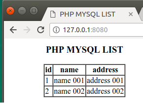

# Docker ELK stack

### Logs
Apache2:8080 ---> logs ---> Logstash:5000

### Ports
* 8080: Apache2
* 8081: phpmyadmin
* 5000: Logstash
* 9200: Elasticsearch
* 9300: Elasticsearch TCP transport
* 5601: Kibana

### Run docker compose
<pre>
docker-compose up -d
</pre>

### Apache webserver

   

### Phpmyadmin with data

   

### Kibana running

   

### Python script (generate http request)

   

