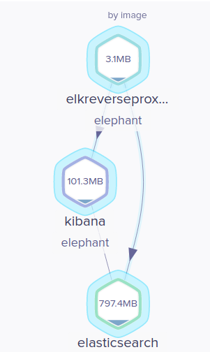

# ELK + nginx proxy_pass with Docker 

### Remember replace with your ip on nginx/nginx.conf
<pre>
proxy_pass      http://your_ip_here:9209/;
proxy_pass      http://you_ip_here:5609/;
</pre>

### Test without login on proxy_passs
<pre>
jprado@T-rex:$ curl  127.0.0.1:9200
401 Authorization Required
401 Authorization Requirednginx/1.17.6
</pre>

### Test with login on proxy_passs
<pre>
jprado@T-rex:$ curl -u test:test 127.0.0.1:9200
{
  "name" : "V_rPy_f",
  "cluster_name" : "elastic",
  "cluster_uuid" : "VI93VpbpRvKUp7CwwiWJQg",
  "version" : {
    "number" : "6.2.4",
    "build_hash" : "ccec39f",
    "build_date" : "2018-04-12T20:37:28.497551Z",
    "build_snapshot" : false,
    "lucene_version" : "7.2.1",
    "minimum_wire_compatibility_version" : "5.6.0",
    "minimum_index_compatibility_version" : "5.0.0"
  },
  "tagline" : "You Know, for Search"
}
</pre>

### Test without login on proxy_passs
<pre>
jprado@T-rex:$ curl  127.0.0.1:5601
401 Authorization Required
401 Authorization Required
nginx/1.17.6

</pre>

### Test with login on proxy_passs
<pre>
jprado@T-rex:$ curl -u test:test 127.0.0.1:5601
      var hashRoute = '/app/kibana';
var defaultRoute = '/app/kibana';

var hash = window.location.hash;
if (hash.length) {
  window.location = hashRoute + hash;
} else {
  window.location = defaultRoute;
</pre>

### Stack

  

This is result of:  watch -n1 "curl -su test:test 127.0.0.1:5601 && curl -su test:test 127.0.0.1:9200"
