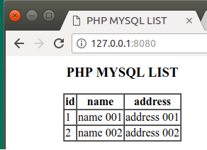
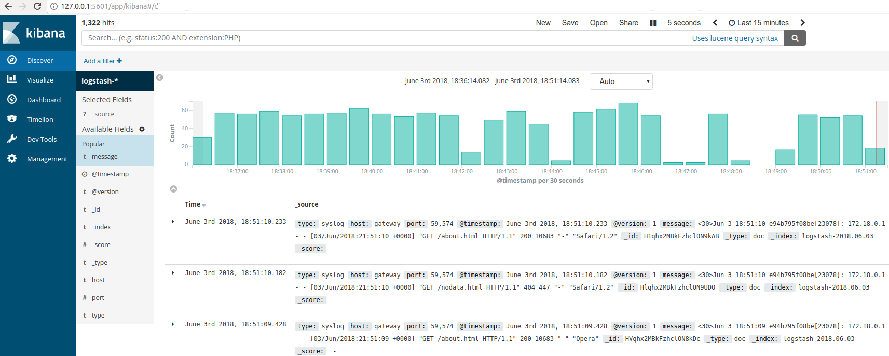
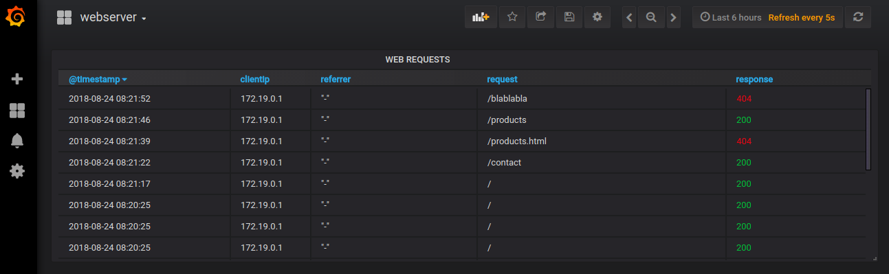
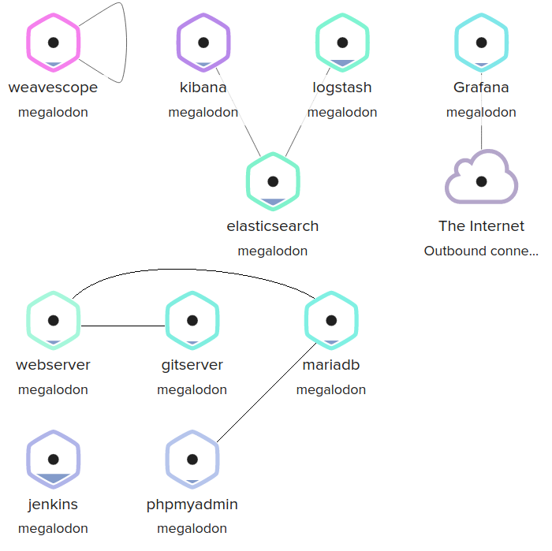
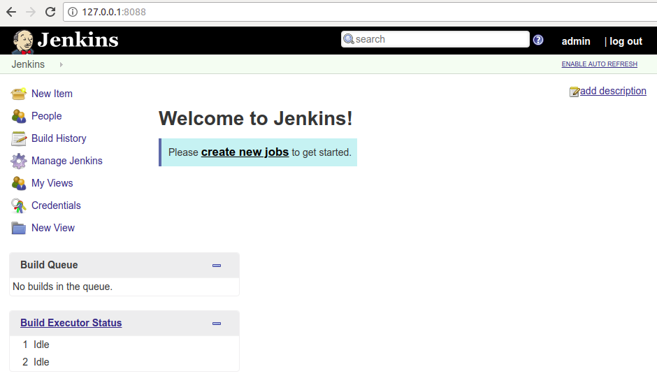
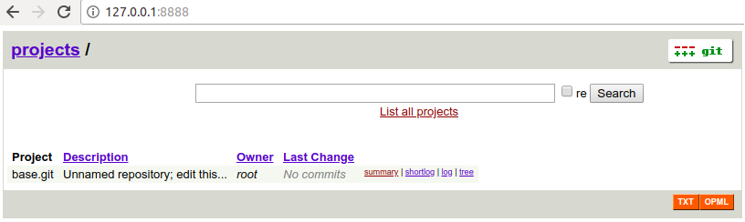
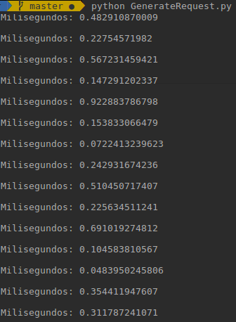

# Docker devops stack

### Logs
* Apache2:8080 ---> logs ---> Logstash:5000 <---> Kibana
* apache2:8080 ---> logs ---> Elasticsearch <---> Grafana
* All-containers <---> weave

### Ports
* 8080: Apache2
* 8081: phpmyadmin
* 5000: Logstash
* 9200: Elasticsearch
* 9300: Elasticsearch TCP transport
* 5601: Kibana
* 3000: Grafana
* 4040: Weave
* 8888: Gitweb (git)
* 8088/443/50000: Jenkins
* 10022: Ansible (pendig) 

### Run docker compose
<pre>
docker-compose up -d
</pre>

### Apache webserver

   

### Phpmyadmin with data

   

### Kibana running

   

### Grafana running

   

### Weave running

   

### Jenkins running

   

### Gitserver running

   

### Python script (generate http request)

   

