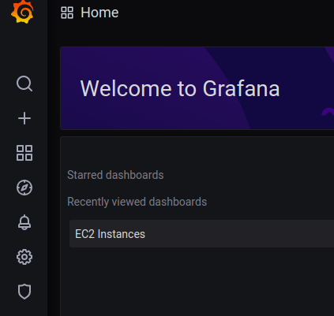
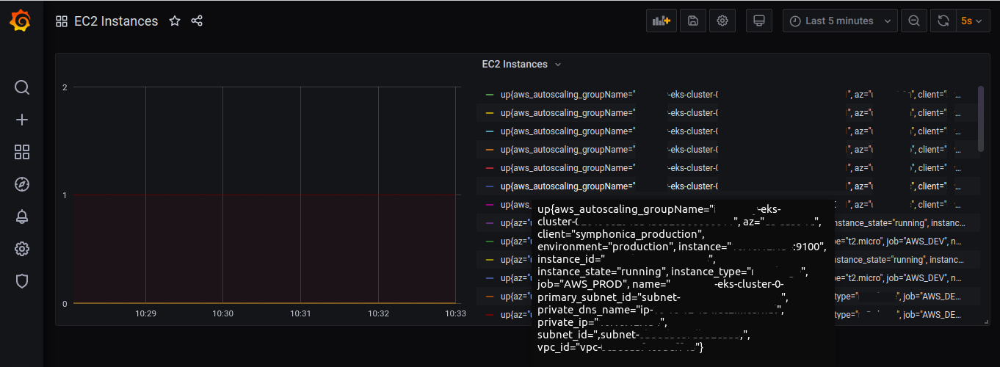

# Prometheus + Grafana with auto-discovery AWS ec2

### Info
<pre>
This way have particularity that if you delete or add new instances, automatically prometheus show it on grafana. 

Prometheus server:
 obtain/consume data of all ec2 instances. 
 That instances run prometheus client and have a SG to permit only connections from Prometheus Server

Prometheus Server config file:  
 It use aws IAM role and aws-cli and to access to ec2 information  this IAM user have "read only access" to this job (describe instances)
 It get all tags,  this tags are used to generate cool graphs in Grafana
 and do filter querys to show differents graph of monitoring
</pre>

### Versions
Grafana: 	7.0.3
Prometheus: 	2.19.0.linux-amd64

### Images

   

   

