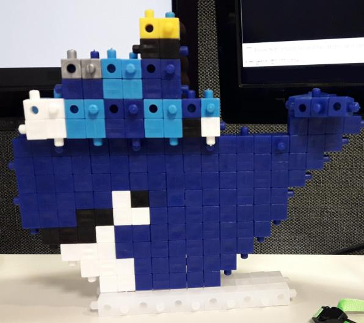

   

### Docker Projects

- [Slack Bot](/SlackBot/)
- [ELK stack](/ELK_docker/)
- [Tests](/old/)

### Docker commands tested

### Run Portainer
<pre>
url: http://127.0.0.1:9000
user: admin
pass: portainer

docker volume create portainer_data; docker run -d -p 9000:9000 --name Portainer -v /var/run/docker.sock:/var/run/docker.sock -v portainer_data:/data portainer/portainer
</pre>

### Run Neo4j
<pre>
url: http://127.0.0.1:7474
user: neo4j
pass: neo4j

docker run -itd --name Neo4j --publish=7474:7474 --publish=7687:7687  neo4j:3.0
docker run -itd --name Neo4j --publish=7474:7474 --publish=7687:7687 --volume=$HOME/neo4j/data:/data --volume=$HOME/neo4j/logs:/logs neo4j:3.0 

</pre>
