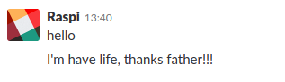

# Slack Bot

### General info
SlackBot receives strings or messages from any channel and executes actions on the server, can change it to another distribution and then add other functions to execute scripts or commands.
You can use by your own risk, the software has no guarantee. By using this script you assume any responsibility.

### Software info
- OS: alpine:3.3
- python: 2.7
- Image size: 59.1 MB

### How to use:
<pre>
# Clone the repo
cd /tmp/ && git clone https://github.com/jpradoar/docker.git

# Acces to folder
cd docker/SlackBot

# replace var
sed -i s'/_%_legacy-token_%_/your_legacy_token_here/g' slackbot.py

# build slack image
docker build -t slackbot:v0.1 .

# run slackbot
docker run -itd --name SlackBot slackbot:v0.1 

# delete data
rm -rf /tmp/docker
</pre>

### Example

