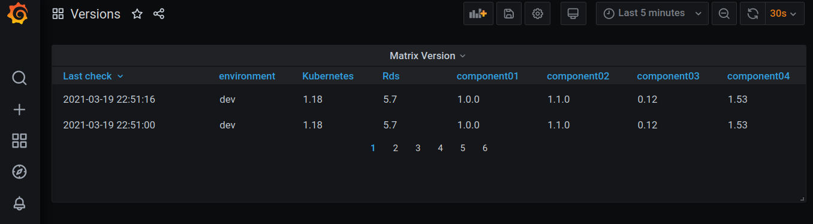

# Dynamic Matrix of environments

### Idea
	I have a lot of version.json of my apps and environment used by development area 
	I would like to see all versions of all systems in a dynamic graph and see when was the las update of each one
	For resolv it, I created a simple "curl" that cosume all json files, parse and save in a elasticsearch.
	With grafana I generate a graph to show all version in a simple graph with date time of last update.
	.
	Status:  80% finished

 

