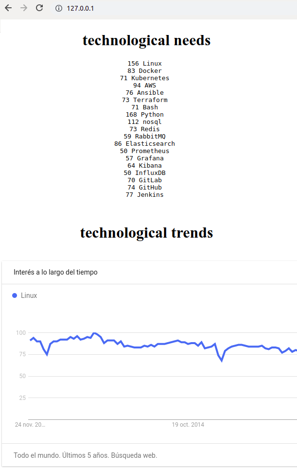

# technology trend

### My idea
<pre>
I searched some jobs websites, and crawled the "GET" request, after that, 
searched my interest technology and get all words, 
and then I calculate the all repeated words and agroup this in a index.html
finaly I added some tendences to know what the market needs.
I know, this is just an estimate, it's not completely real
</pre>

### who to run
<pre>
- Download repo
- acces to folder
- build your image
	docker build -t tend .
- run your magic container ( ta taann...)
	docker run -itd --name tendencias -p 80:80 tend
- access to container http://localhost/
</pre>

   

